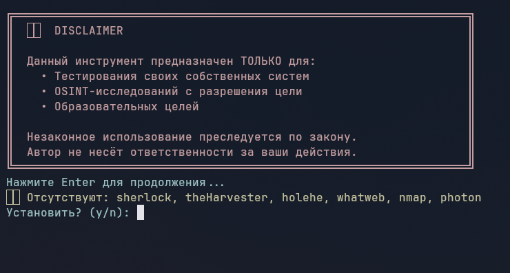
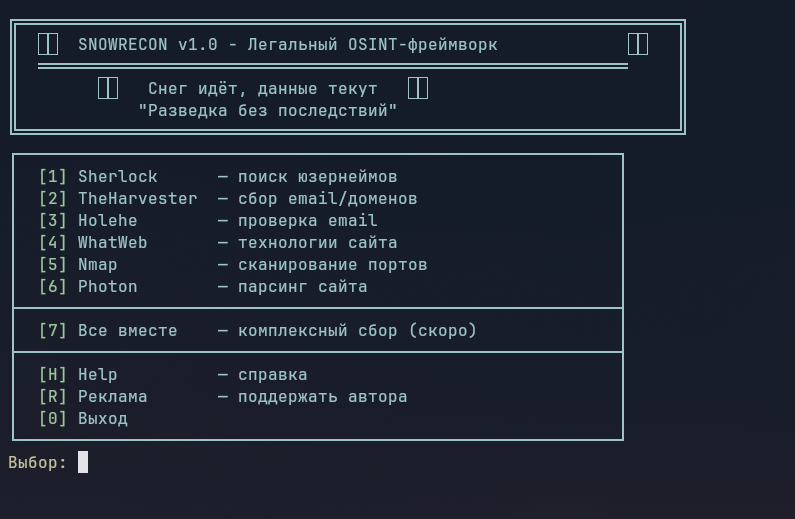

# ❄️ SNOWRECON (в разработке)

❄️SNOWRECON v1.0 - Легальный OSINT-фреймворк❄️
🎄   Снег идёт, данные текут   🎄
"Разведка без последствий"


Легальный сбор открытых данных. Sherlock, theHarvester, Holehe, WhatWeb, Nmap, Photon — в одном флаконе.

| Фото 1 | Фото 2 |
|--------|--------|
|  |  |

## Инструменты

| # | Инструмент | Что делает |
|---|------------|-------------|
| 1 | Sherlock | Поиск юзернеймов по 300+ соцсетям |
| 2 | TheHarvester | Сбор email, доменов, поддоменов, IP |
| 3 | Holehe | Проверка email в 100+ сервисах |
| 4 | WhatWeb | Определение технологий сайта |
| 5 | Nmap | Сканирование портов (топ 100) |
| 6 | Photon | Парсинг ссылок и файлов с сайта |

## Установка

### Linux / Mac

```bash
git clone https://github.com/web-pentest/SNOWRECON.git
cd SNOWRECON
pip install -r requirements.txt
python3 snowrecon.py
```

### Windows

```bash
git clone https://github.com/web-pentest/SNOWRECON.git
cd SNOWRECON
pip install -r requirements.txt
python snowrecon.py
```

## Дисклеймер

Данный инструмент предназначен ТОЛЬКО для:
- Тестирования своих собственных систем
- OSINT-исследований с разрешения цели
- Образовательных целей

Незаконное использование преследуется по закону. Автор не несёт ответственности за ваши действия.

## Меню

| КОМАНДА | МЕНЮ | Что делает |
|---|------------|-------------|
| 1 | Sherlock | поиск юзернеймов | 
| 2 | TheHarvester | сбор email/доменов | 
| 3 | Holehe | проверка email | 
| 4 | WhatWeb | технологии сайта | 
| 5 | Nmap | сканирование портов | 
| 6 | Photon | парсинг сайта | 
| H | Help | справка | 
| R | Реклама | поддержать автора | 
| 0 | Выход | выход | 

## Автор
**web-pentest**
GitHub: https://github.com/web-pentest

## Лицензия
MIT License
Copyright (c) 2026 web-pentest

- ╔══════════════════════════════════════════════════╗
- ║  ⚠️  DISCLAIMER                                  
- ║                                                  
- ║  Данный инструмент предназначен ТОЛЬКО для:      
- ║    • Тестирования своих собственных систем       
- ║    • OSINT-исследований с разрешения цели        
- ║    • Образовательных целей                       
- ║                                                  
- ║  Незаконное использование преследуется по закону.
- ║  Автор не несёт ответственности за ваши действия.
- ╚══════════════════════════════════════════════════╝

## Требования
Убедитесь, что у вас установлен Python 3.6+ и pip.

